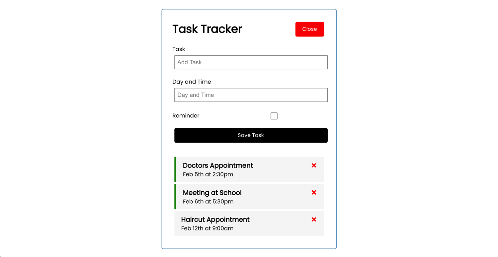

# Task Tracker

This is a React project that goes with the [React JS Crash Course 2021](https://youtu.be/w7ejDZ8SWv8) by [Traversy Media](https://traversymedia.com).

## Table of contents

- [Overview](#overview)
  - [Screenshot](#screenshot)
  - [Links](#links)
- [My process](#my-process)
  - [Built with](#built-with)
  - [What I learned](#what-i-learned)
- [Author](#author)

## Overview

### Screenshot

### Links

- Live Site URL: [Live Site](https://lucid-kare-8089aa.netlify.app/)

## My process

### Built with

- HTML5
- CSS
- REACT JS

### What I learned

I learned the basic workflow of React JS in this project, including: file structure, components, props, and the useState hook.

## Author

- Website - [Chris Korsak](https://www.chriskorsak.net)
